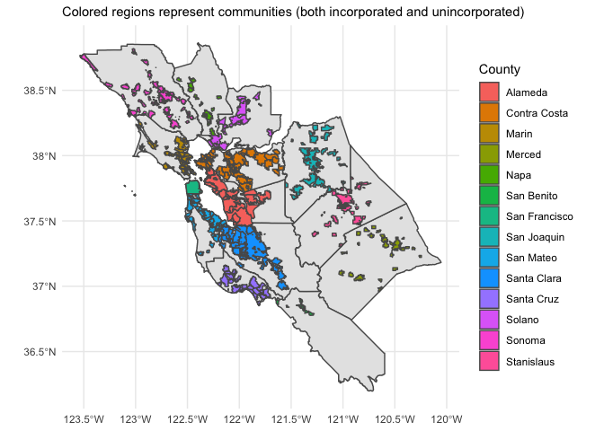
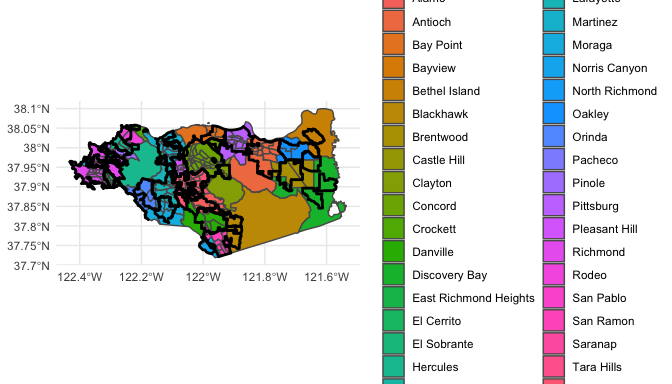
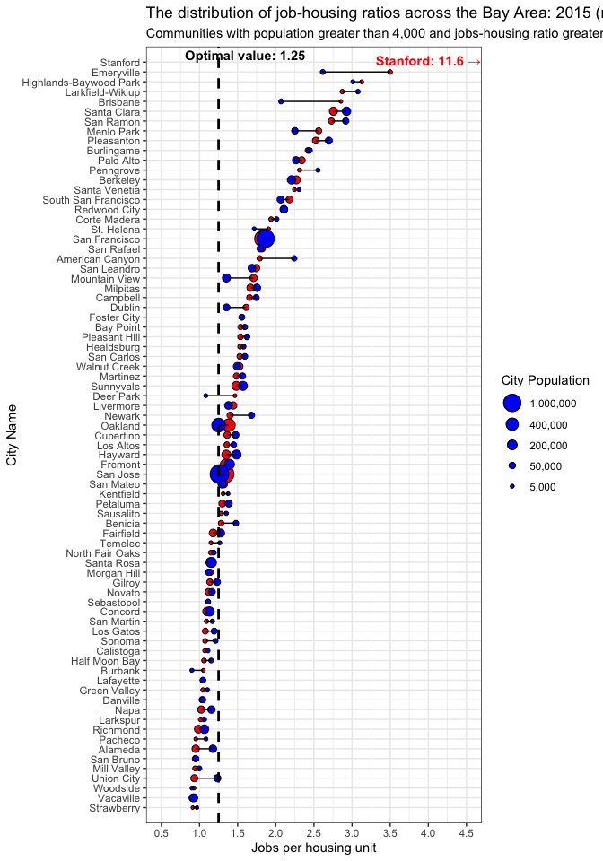
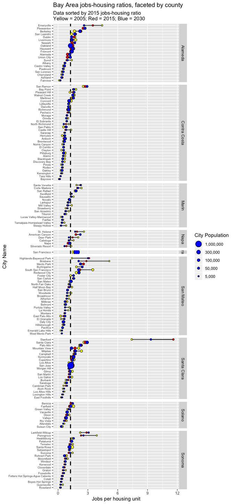
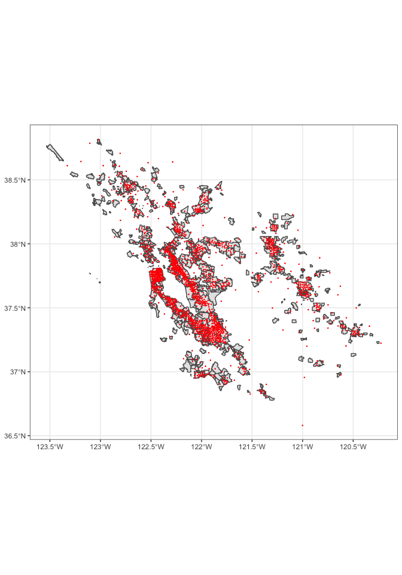

Housing Jobs Mismatch and Associated Emissions Impacts
================
Robert Spragg
2020-01-19

  - [Abstract](#abstract)
  - [Introduction](#introduction)
  - [Related Work](#related-work)
  - [Datasets](#datasets)
  - [Methods: Part 1](#methods-part-1)
  - [Methods: Part 2](#methods-part-2)
  - [Assigning Emissions Impacts to
    Communities](#assigning-emissions-impacts-to-communities)
  - [Emissions Estimate](#emissions-estimate)
      - [Results & Discussion](#results-discussion)
      - [References](#references)
      - [Appendix](#appendix)

## Abstract

This report is split into two main sections.

In the first section, spatial data from Caltrans and the Metropolitan
Transportation Commission is utilized to estimate the population, number
of jobs, number of housing units, and number of households in each Bay
Area city. Variations in the ratio of jobs to housing units across
cities and counties are explored, and the most imbalanced regions are
identified. Next, the total shortage of housing units in the Bay Area is
estimated, and the housing deficit is calculated for each city.

In the second section, census data is utilized to observe commutes to
regions with a high ratio of jobs to housing units. The average commute
distance to San Francisco, as well as to each city in San Mateo and
Santa Clara counties, is estimated and compared to the commuting
distance of residents of the three counties. Finally, the additional
vehicle-miles traveled and carbon emissions caused by the housing
imbalance of these three regions is estimated.

## Introduction

Currently, the Bay Area faces an extreme housing shortage, rapidly
increasing rents, and ever-worsening commute times. Since 1990, the Bay
Area has added two jobs for each housing unit.\[1\] Most of the housing
units that have been built are far from job centers, which has caused
carbon dioxide emissions from the transportation sector to increase.
Transportation sector emissions are now the largest source of emissions
in California at over 40%.\[2\] The lack of housing options has forced
many residents into extremely long commutes from the Central Valley.
This has become so commonplace that the San Jose - San Francisco -
Oakland Combined Statistical Area (CSA) was modified to include
Stanislaus and Merced counties in September 2018.\[3\]

There are multiple reasons for the housing crisis, including but not
limited to: exclusionary zoning practices, a booming tech economy,
apartment bans, the lengthy public approval process for new infill
developments, litigation involving the California Environmental Quality
Act (CEQA), Proposition 13, and the region’s unique topography.

## Related Work

I have previously written an article titled ‘Decarbonization and Density
go Hand in Hand’, which explains the current state of housing policy in
California, and how changing our land use patterns could enable more
rapid decarbonization of the buildings and transportation sectors.\[4\].
Many other authors have written about the housing crisis. The Public
Policy Institute of California found that “restrictive zoning and
planning regulations can depress housing supply and increase housing
costs.”\[5\] Finally, Governor Newsom has voiced his support for a
radical paradigm shift in California by advocating for the construction
of 3.5 million new homes in California by 2025.\[6\] This equates to a
housing growth rate that is more than 5 times faster than what
California has experienced during the past decade.

## Datasets

1.  The Metropolitan Transportation Commission (MTC) maintains a dataset
    that contains employment, households, land use, and population data
    for 1454 Transportation Analysis Zones (TAZs) for the nine-country
    region.\[7\] Historical data from 2005, 2010, and 2015, as well as
    future forecasts to 2040, in five-year intervals, are available.

2.  Caltrans maintains a spatial file which has the city boundaries of
    every city in California.

3.  Stanford maintains an online GIS repository called EarthWorks. From
    this site, county shapefiles for the nine-county Bay Area region
    were utilized.\[8\]

4.  A study from Nelson & Rae utilized American Community Survey’s
    commuting and workplace dataset.\[9\] This dataset provides
    census-tract level information on the origin and destination of
    commute trips.

5.  Census tract data for each county was found on various county Open
    Data platforms.\[10\]

## Methods: Part 1

The Caltrans city limits dataset, along with the county shapefile
boundaries, appears as follows.

``` r
# Filter for counties in the 14 county Bay Area CSA
csa_counties <-
  ca_county %>% 
  filter(COUNTY %in% bay_area_counties)

# Join with all counties and then filter to avoid putting cities in wrong county
csa_cities <-
  ca_cities %>% 
  st_join(ca_county, largest = TRUE) %>% 
  filter(COUNTY %in% bay_area_counties)
```

    ## although coordinates are longitude/latitude, st_intersection assumes that they are planar

    ## Warning: attribute variables are assumed to be spatially constant
    ## throughout all geometries

``` r
# Remove portion of polygon that is over water in Ocean / SF Bay
csa_cities_cleaned <-
  st_intersection(csa_counties, csa_cities %>% st_transform(crs = 4326))
```

    ## although coordinates are longitude/latitude, st_intersection assumes that they are planar

    ## Warning: attribute variables are assumed to be spatially constant
    ## throughout all geometries

``` r
# Plot of communities in the 14-county region
ggplot() +
  geom_sf(data = csa_counties) +
  geom_sf(
    aes(fill = COUNTY),
    data = csa_cities_cleaned
  ) +
  theme(legend.position = "none") +
  theme_minimal() +
  labs(
    subtitle = "Colored regions represent communities (both incorporated and unincorporated)",
    fill = "County"
  )
```

<!-- -->

The MTC data file has the following non-spatial components for each TAZ
(first 5 rows are shown, out of 1454).

We load the columns from each file of interest. Remember to check the
`crs` of the spatial file.

``` r
## SPATIAL FILE
mtc_taz <-
  read_sf(dsn = mtc_taz_shp)

st_crs(mtc_taz)
```

    ## Coordinate Reference System:
    ##   EPSG: 4326 
    ##   proj4string: "+proj=longlat +datum=WGS84 +no_defs"

``` r
mtc_jobs <-
  read_csv(mtc_taz_jobs,
    col_types = 
      cols_only(
        totemp05 = col_integer(),
        totemp15 = col_integer(),
        totemp30 = col_integer(),
        zoneid = col_integer()
      )
  )  
  
mtc_housing <-
  read_csv(
    mtc_taz_land_use,
    col_types = 
      cols_only(
        sfdu05 = col_integer(),
        mfdu05 = col_integer(),
        sfdu15 = col_integer(),
        mfdu15 = col_integer(),
        sfdu30 = col_integer(),
        mfdu30 = col_integer(),
        zoneid = col_integer()
      )
  ) 

mtc_pop <-
  read_csv(
    mtc_taz_pop,
    col_types = 
      cols_only(
        totpop05 = col_integer(),
        totpop15 = col_integer(),
        totpop30 = col_integer(),
        zoneid = col_integer()
      )
  )
```

Next, join each TAZ data file with the TAZ spatial data.

``` r
taz_all <-
  mtc_taz %>% 
  left_join(mtc_jobs, by = c("taz1454" = "zoneid")) %>% 
  left_join(mtc_housing, by = c("taz1454" = "zoneid")) %>% 
  left_join(mtc_pop, by = c("taz1454" = "zoneid"))
```

Let’s preview the data (excluding the geometry). `totemp` refers to the
total number of jobs (2005 and 2015 actuals, 2030 forecast) for each
TAZ.

`sfdu` and `mfdu` refer to single-family and multi-family dwelling
units, respectively.

`totpop` refers to the population for each TAZ.

``` r
taz_all %>% st_drop_geometry() %>% 
  slice(1:5) %>% 
  kable()
```

| objectid | taz1454 | district | county      |    gacres | Shape\_\_Are | Shape\_\_Len | totemp05 | totemp15 | totemp30 | sfdu05 | sfdu15 | sfdu30 | mfdu05 | mfdu15 | mfdu30 | totpop05 | totpop15 | totpop30 |
| -------: | ------: | -------: | :---------- | --------: | -----------: | -----------: | -------: | -------: | -------: | -----: | -----: | -----: | -----: | -----: | -----: | -------: | -------: | -------: |
|        1 |     566 |       11 | Santa Clara | 1708.6831 |    0.0004439 |    0.0975496 |     1603 |     1413 |     1768 |    197 |    318 |    319 |   1525 |   4859 |   4859 |     3556 |    11150 |    12553 |
|        2 |     565 |       11 | Santa Clara |  486.2007 |    0.0001263 |    0.0541711 |     1065 |     1748 |     2203 |    543 |    681 |    681 |   1280 |   1550 |   1550 |     3917 |     5126 |     5490 |
|        3 |     573 |       11 | Santa Clara |  538.0699 |    0.0001398 |    0.0570528 |       46 |      265 |      376 |   1120 |   1029 |   1029 |      8 |      7 |      7 |     4695 |     3966 |     4157 |
|        4 |     571 |       11 | Santa Clara |  450.4079 |    0.0001170 |    0.0520419 |      174 |      432 |      755 |    820 |    888 |    888 |     54 |     59 |     59 |     4065 |     4227 |     4475 |
|        5 |     576 |       11 | Santa Clara |  423.2730 |    0.0001099 |    0.0434378 |      365 |      427 |      551 |   1182 |   1134 |   1134 |      0 |      0 |      0 |     5215 |     4681 |     4908 |

The MTC spatial data, overlaid on the 9-county region, appears as
follows.

``` r
taz_all %>% 
  ggplot() +
  geom_sf(aes(fill = county, color = NULL), alpha = 0.6) +
  geom_sf(data = csa_counties, color = "black", size = 1, alpha = 0) +  
  theme_minimal() +
  labs(
    fill = "County"
  )
```

<!-- -->

Each TAZ is in only one county. We are interested in knowing information
for each city, but our data is currently defined by the TAZs. Therefore,
we join each TAZ with a single city. The `largest = TRUE` argument is
used in `st_join` to match each TAZ to the city that it lies in the
most. Let’s observe the join results for San Mateo, Santa Clara,
Alameda, and Contra Costa counties to make sure the results are
accurate.

There are two TAZs that joined to a city in another county (1044 and
297). This occurred when the city limit bordered the county line
adjacent to a TAZ in the other county that was not within any city in
its respective county. For these zones, the city value is set to `NA`.

``` r
mtc_city_joined <-
  taz_all %>% 
  st_join(csa_cities_cleaned, largest = TRUE) %>% 
  mutate(NAME = if_else(county != COUNTY, NA_character_, NAME))
```

    ## although coordinates are longitude/latitude, st_intersection assumes that they are planar

    ## Warning: attribute variables are assumed to be spatially constant
    ## throughout all geometries

San Mateo County

``` r
mtc_city_joined %>% 
  filter(county %in% c("San Mateo")) %>% 
  ggplot() +
  geom_sf(aes(fill = NAME)) +
  geom_sf(
    data = csa_cities_cleaned %>% filter(COUNTY == "San Mateo"), 
    fill = NA,
    color = "black",
    size = 1
  ) +
  coord_sf(
    ylim = c(37.3, 37.75)
  ) +
  theme_minimal() +
  labs(
    fill = "City"
  )
```

<!-- -->

Santa Clara County (code suppressed)
<!-- -->

Check the population of the largest TAZs in Santa Clara County

``` r
mtc_city_joined %>% 
  filter(county %in% c("Santa Clara")) %>% 
  arrange(-gacres)
```

    ## Simple feature collection with 368 features and 39 fields
    ## geometry type:  MULTIPOLYGON
    ## dimension:      XY
    ## bbox:           xmin: -122.2025 ymin: 36.89416 xmax: -121.2082 ymax: 37.48464
    ## epsg (SRID):    4326
    ## proj4string:    +proj=longlat +datum=WGS84 +no_defs
    ## # A tibble: 368 x 40
    ##    objectid taz1454 district county gacres Shape__Are Shape__Len
    ##       <dbl>   <dbl>    <dbl> <chr>   <dbl>      <dbl>      <dbl>
    ##  1      226     714       14 Santa… 5.92e5    0.154        2.63 
    ##  2      186     704       14 Santa… 1.03e5    0.0268       1.17 
    ##  3      133     512       10 Santa… 5.49e4    0.0143       0.685
    ##  4      349     347        8 Santa… 5.28e4    0.0137       0.813
    ##  5      211     706       14 Santa… 3.77e4    0.00984      0.595
    ##  6      183     697       14 Santa… 3.09e4    0.00803      0.436
    ##  7      206     713       14 Santa… 1.99e4    0.00518      0.472
    ##  8      224     712       14 Santa… 1.60e4    0.00417      0.409
    ##  9      317     404        9 Santa… 1.58e4    0.00410      0.458
    ## 10      137     696       13 Santa… 1.49e4    0.00387      0.473
    ## # … with 358 more rows, and 33 more variables: geometry <MULTIPOLYGON
    ## #   [°]>, totemp05 <int>, totemp15 <int>, totemp30 <int>, sfdu05 <int>,
    ## #   sfdu15 <int>, sfdu30 <int>, mfdu05 <int>, mfdu15 <int>, mfdu30 <int>,
    ## #   totpop05 <int>, totpop15 <int>, totpop30 <int>, FIPSSTCO <chr>,
    ## #   COUNTY <chr>, STATEFP <chr>, PLACEFP <chr>, PLACENS <chr>,
    ## #   GEOID <chr>, NAME <chr>, NAMELSAD <chr>, LSAD <chr>, CLASSFP <chr>,
    ## #   PCICBSA <chr>, PCINECTA <chr>, MTFCC <chr>, FUNCSTAT <chr>,
    ## #   ALAND <dbl>, AWATER <dbl>, INTPTLAT <chr>, INTPTLON <chr>,
    ## #   FIPSSTCO.1 <chr>, COUNTY.1 <chr>

Alameda County (code suppressed)
<!-- -->

Contra Costa County (code suppressed)
<!-- -->

In densely populated areas, the merging does a great job of mapping the
TAZs to cities. The only densely populated area that is not matched to a
city is in Alameda county. This region corresponds to Castro Valley
(which apparently is unincorporated\!).

**Calculating the Ratio of Housing to Jobs**

Now that the MTC spatial, housing, and jobs data is merged with the city
limit spatial data, we now know *approximately* which zones correspond
to which city.

Many recent news articles have focused on the lack of new housing in the
Bay Area. \[11\] Let’s see if their worries are accurate.

For each city, we will calculate the ratio of jobs per housing unit for
2005, 2015, and 2030. Both single-family and multi-family housing units
are included.

``` r
jobs_housing_ratios <-
  mtc_city_joined %>% 
  select_at(
    vars(matches("(NAME)|(county)|(sfdu)|(mfdu)|(totemp)|(totpop)"))
  ) %>% 
  select(-county) %>% 
  rename_all(str_to_lower) %>% 
  group_by(name, county) %>% 
  summarize(
    city_pop_05 = sum(totpop05),
    city_pop_15 = sum(totpop15),
    city_pop_30 = sum(totpop30),
    job_house_05 = sum(totemp05) / (sum(sfdu05) + sum(mfdu05)),
    job_house_15 = sum(totemp15) / (sum(sfdu15) + sum(mfdu15)),
    job_house_30 = sum(totemp30) / (sum(sfdu30) + sum(mfdu30)),
    city_units_05 = sum(sfdu05) + sum(mfdu05),
    city_units_15 = sum(sfdu15) + sum(mfdu15),
    city_units_30 = sum(sfdu30) + sum(mfdu30)
  ) %>% 
  ungroup()

mtc_city_joined %>% st_drop_geometry() %>% 
  summarize(
    jobs_added = sum(totemp15) - sum(totemp05),
    units_added = sum(sfdu15) + sum(mfdu15) - sum(sfdu05) - sum(mfdu05),
    ratio = jobs_added / units_added
  )
```

    ## # A tibble: 1 x 3
    ##   jobs_added units_added ratio
    ##        <int>       <int> <dbl>
    ## 1     434202      311336  1.39

``` r
mtc_city_joined %>% st_drop_geometry() %>% filter(county == "San Francisco") %>% 
  summarize(
    jobs_added = sum(totemp15) - sum(totemp05),
    units_added = sum(sfdu15) + sum(mfdu15) - sum(sfdu05) - sum(mfdu05),
    ratio = jobs_added / units_added
  )
```

    ## # A tibble: 1 x 3
    ##   jobs_added units_added ratio
    ##        <int>       <int> <dbl>
    ## 1     180048       69486  2.59

Between 2005 and 2015, the Bay Area as a whole added approximately 1.4
jobs for each housing unit built. However, San Francisco added
approximately **2.6** jobs for each housing unit during the same time
period. It is also important to note that the Great Recession depressed
employment numbers during this period.

**What is the ideal housing-jobs ratio?**

In order for a city to be a place where people can both live and work,
there must be both housing units and employment opportunities. However,
the ideal ratio of jobs to housing is definitely undecided. Some authors
have suggested that 1.5 is the highest value before traffic is severely
impacted (Cevero 1989). Others list optimal values between 1.0 and 1.25
(Margolis, 1957).

**Visualizing the Housing-Jobs Mismatch**

I began by plotting the 2005, 2015, and 2030 ratios of jobs to housing
units for each Bay Area city. The cities are ordered from highest to
lowest ratio in 2015. The Southern California Association of Governments
established a target ratio of jobs to housing untis of 1.25. Therefore,
we will use 1.25 as our target ratio for the Bay Area.

``` r
jobs_housing_ratios %>% 
  filter(city_pop_15 >= 5000, job_house_15 > 0.8, name == "Stanford") %>% 
  arrange(job_house_15)
```

    ## Simple feature collection with 1 feature and 11 fields
    ## geometry type:  POLYGON
    ## dimension:      XY
    ## bbox:           xmin: -122.1913 ymin: 37.40634 xmax: -122.1471 ymax: 37.44744
    ## epsg (SRID):    4326
    ## proj4string:    +proj=longlat +datum=WGS84 +no_defs
    ## # A tibble: 1 x 12
    ##   name  county city_pop_05 city_pop_15 city_pop_30 job_house_05
    ##   <chr> <chr>        <int>       <int>       <int>        <dbl>
    ## 1 Stan… Santa…       15542       16679       20669         7.41
    ## # … with 6 more variables: job_house_15 <dbl>, job_house_30 <dbl>,
    ## #   city_units_05 <int>, city_units_15 <int>, city_units_30 <int>,
    ## #   geometry <POLYGON [°]>

Figure showing 2015 jobs-housing ratios

``` r
jobs_housing_ratios %>% 
  filter(job_house_15 > 0.9, city_pop_15 > 4000) %>% 
  ggplot() +
  geom_point(aes(x = job_house_15, y = reorder(name, job_house_15), size = city_pop_15), shape = 21, fill = "red") +
  geom_vline(xintercept = 1.25, linetype = "dashed", color = "black", size = 1) +
  annotate("text", x = 4, y = 77.2, label = "Stanford: 11.6 →", color = "red", fontface = "bold") +
  annotate("text", x = 1.6, y = 77.7, label = "Optimal value: 1.25") +
  scale_x_continuous(breaks = seq(0.5, 5, 0.5)) +
  scale_size_continuous(
    breaks = c(1000000, 400000, 200000, 50000, 5000),
    labels = scales::comma_format(accuracy = 1),
    range = c(1, 7)
  ) +
  coord_cartesian(xlim = c(0.5, 4.5), ylim = c(0, 78)) +
  theme_bw() +
  labs(
    x = "Jobs per housing unit",
    y = "City Name",
    title = "The distribution of job-housing ratios across the Bay Area (2015)",
    subtitle = "Communities with population greater than 4,000 and jobs-housing ratio greater than 0.9",
    size = "City Population"
  )
```

<!-- -->

Figure showing 2015 and 2030 jobs-housing ratios

``` r
jobs_housing_ratios %>% 
  filter(job_house_15 > 0.9, city_pop_15 > 4000) %>% 
  ggplot() +
  geom_point(aes(x = job_house_15, y = reorder(name, job_house_15), size = city_pop_15), shape = 21, fill = "red") +
  geom_point(aes(x = job_house_30, y = name, size = city_pop_30), shape = 21, fill = "blue") +
  geom_segment(aes(x = job_house_15, y = name, xend = job_house_30, yend = name)) +
  geom_vline(xintercept = 1.25, linetype = "dashed", color = "black", size = 1) +
  annotate("text", x = 4, y = 77.2, label = "Stanford: 11.6 →", color = "red", fontface = "bold") +
  annotate("text", x = 1.6, y = 77.7, label = "Optimal value: 1.25", fontface = "bold") +
  scale_x_continuous(breaks = seq(0.5, 5, 0.5)) +
  scale_size_continuous(
    breaks = c(1000000, 400000, 200000, 50000, 5000),
    labels = scales::comma_format(accuracy = 1),
    range = c(1, 7)
  ) +
  coord_cartesian(xlim = c(0.5, 4.5), ylim = c(0, 78)) +
  theme_bw() +
  labs(
    x = "Jobs per housing unit",
    y = "City Name",
    title = "The distribution of job-housing ratios across the Bay Area: 2015 (red) and 2030 (blue)",
    subtitle = "Communities with population greater than 4,000 and jobs-housing ratio greater than 0.9",
    size = "City Population"
  )
```

<!-- -->

One can also facet by county to see if any county-specific trends
appear.

``` r
jobs_housing_ratios %>% 
  mutate(name = fct_reorder(name, job_house_15)) %>%  
  filter(city_pop_15 >= 4000) %>% 
  ggplot() +
  geom_segment(aes(x = job_house_05, y = name, xend = job_house_15, yend = name)) +
  geom_segment(aes(x = job_house_15, y = name, xend = job_house_30, yend = name)) +
  geom_vline(xintercept = 1.25, linetype = "dashed", color = "black", size = 1) +  
  geom_point(aes(x = job_house_05, y = name, size = city_pop_05), shape = 21, fill = "yellow") +
  geom_point(aes(x = job_house_15, y = name, size = city_pop_15), shape = 21, fill = "red") +
  geom_point(aes(x = job_house_30, y = name, size = city_pop_30), shape = 21, fill = "blue") +
  facet_grid(rows = vars(county), scales = "free", space = "free") +
  scale_size_continuous(
    breaks = c(1000000, 300000, 100000, 50000, 5000),
    labels = scales::comma_format(accuracy = 1)
  ) +
  theme(
    axis.text.y = element_text(size = 6)
  ) +
  labs(
    x = "Jobs per housing unit",
    y = "City Name",
    size = "City Population",
    title = "Bay Area jobs-housing ratios, faceted by county",
    subtitle = "Data sorted by 2015 jobs-housing ratio \nYellow = 2005; Red = 2015; Blue = 2030",
    size = "City Population"    
  )
```

<!-- -->

Every county (except San Francisco, which is both a city and a county)
has a wide array of job-housing ratios within its boundaries. It appears
as though most counties have cities that are job centers as well as
cities that act as suburbs and or bedroom communities. Let’s calculate
the county-wide averages for 2005, 2015, and 2030, weighted by the
number of housing units during each time period in each city.

``` r
jobs_housing_ratios %>% 
  group_by(county) %>% 
  summarize(
    avg_ratio_05 = weighted.mean(job_house_05, city_units_05),
    avg_ratio_15 = weighted.mean(job_house_15, city_units_15),
    avg_ratio_30 = weighted.mean(job_house_30, city_units_30)
  ) %>% 
  gather(key = "year", value = "ratio", avg_ratio_05:avg_ratio_30) %>% 
  ggplot(aes(x = year, y = ratio)) +
  geom_hline(yintercept = 1.25, linetype = "dashed", color = "black", size = 1) +
  geom_line(aes(group = county, color = county), size = 0.8) +
  geom_point(aes(color = county)) +
  theme_minimal() +
  scale_x_discrete(
    labels = c("2005", "2015", "2030")
  ) +
  labs(
    x = "Year",
    y = "Average jobs per housing unit",
    color = "County",
    subtitle = "Optimal value: 1.25 jobs per housing unit"
  )
```

    ## Warning: Removed 2 rows containing missing values (geom_path).

    ## Warning: Removed 2 rows containing missing values (geom_point).

<!-- -->

We can also find the average for the entire 9-county region for the
three periods.

``` r
jobs_housing_ratios %>% st_drop_geometry() %>% 
  summarize(
    avg_ratio_05 = weighted.mean(job_house_05, city_units_05),
    avg_ratio_15 = weighted.mean(job_house_15, city_units_15),
    avg_ratio_30 = weighted.mean(job_house_30, city_units_30)    
  ) %>% 
  pull(avg_ratio_15)
```

    ## [1] 1.385109

Let’s see who is contributing the most to the region’s housing deficit.
The deficit is calculated as the additional housing supply in 2015
needed to provide a 1.25 ratio of jobs (2015 data) to housing units.

``` r
deficit <-
  jobs_housing_ratios %>% 
  # filter(job_house_15 >= 1.25) %>% 
  mutate(
    housing_deficit = round(city_units_15 * job_house_15 / 1.25 - city_units_15),
    existing_units = city_units_15,
    growth = housing_deficit / city_units_15 * 100
  ) %>% 
  arrange(-housing_deficit) %>% 
  select(name, housing_deficit, existing_units, growth)

deficit %>% 
  st_drop_geometry() %>% 
  slice(1:10) %>% 
  kable()
```

| name          | housing\_deficit | existing\_units |     growth |
| :------------ | ---------------: | --------------: | ---------: |
| San Francisco |           189786 |          408409 |  46.469593 |
| Santa Clara   |            57122 |           47415 | 120.472424 |
| Stanford      |            49999 |            6038 | 828.072209 |
| Berkeley      |            41233 |           50536 |  81.591341 |
| Pleasanton    |            25107 |           24606 | 102.036089 |
| Palo Alto     |            24971 |           28615 |  87.265420 |
| San Jose      |            24352 |          350810 |   6.941649 |
| Redwood City  |            22924 |           33423 |  68.587500 |
| San Ramon     |            20830 |           17596 | 118.379177 |
| Oakland       |            19194 |          176872 |  10.851916 |

``` r
deficit
```

    ## Simple feature collection with 174 features and 4 fields
    ## geometry type:  GEOMETRY
    ## dimension:      XY
    ## bbox:           xmin: -123.5337 ymin: 36.89416 xmax: -121.2082 ymax: 38.86425
    ## epsg (SRID):    4326
    ## proj4string:    +proj=longlat +datum=WGS84 +no_defs
    ## # A tibble: 174 x 5
    ##    name   housing_deficit existing_units growth                    geometry
    ##    <chr>            <dbl>          <int>  <dbl>              <GEOMETRY [°]>
    ##  1 San F…          189786         408409  46.5  MULTIPOLYGON (((-123.0036 …
    ##  2 Santa…           57122          47415 120.   POLYGON ((-121.9503 37.338…
    ##  3 Stanf…           49999           6038 828.   POLYGON ((-122.1566 37.419…
    ##  4 Berke…           41233          50536  81.6  POLYGON ((-122.2425 37.857…
    ##  5 Pleas…           25107          24606 102.   POLYGON ((-121.8269 37.673…
    ##  6 Palo …           24971          28615  87.3  POLYGON ((-122.1873 37.416…
    ##  7 San J…           24352         350810   6.94 POLYGON ((-121.7335 36.992…
    ##  8 Redwo…           22924          33423  68.6  POLYGON ((-122.2206 37.458…
    ##  9 San R…           20830          17596 118.   POLYGON ((-121.9364 37.724…
    ## 10 Oakla…           19194         176872  10.9  POLYGON ((-122.1158 37.748…
    ## # … with 164 more rows

San Francisco, Palo Alto, Santa Clara, and Berkeley have the highest
housing deficits. Let’s also look at the opposite end of the spectrum to
see which communities could use more jobs.

``` r
deficit_jobs <-
  jobs_housing_ratios %>% 
  filter(job_house_15 < 1.25) %>% 
  mutate(housing_surplus = round(city_units_15 * job_house_15 / 1.25 - city_units_15)) %>% 
  arrange(housing_surplus) %>% 
  select(name, housing_surplus)

deficit_jobs %>% st_drop_geometry() %>% 
  mutate(housing_surplus = -1 * housing_surplus) %>% 
  rename(Name = name, `Housing Surplus` = housing_surplus) %>% 
  slice(1:10) %>% 
  kable()
```

| Name          | Housing Surplus |
| :------------ | --------------: |
| Daly City     |           17451 |
| Vallejo       |           16439 |
| Antioch       |           15775 |
| Castro Valley |           11492 |
| Pittsburg     |           11103 |
| Brentwood     |            9653 |
| Pacifica      |            9325 |
| Oakley        |            8939 |
| Blackhawk     |            8893 |
| Vacaville     |            8531 |

Unincorporated, rural regions tend to have more housing units than jobs.
Cities with a notable lack of jobs include Daly City as well as the
far-flung suburbs of Vallejo, Antioch, Brentwood, and Pittsburg.

Let’s create a spatial visualization of the housing shortage.

``` r
NYT_DEM <- "#1A80C4"
NYT_REP <- "#CC3D41"
light_red <- "#FDB8A9"
dark_red <- "#9C2A12"

deficit %>% 
  ggplot() +
  geom_sf(aes(fill = NULL), data = csa_counties) +
  geom_sf(aes(fill = NULL), color = "black", data = csa_cities_cleaned) +
  geom_sf(aes(fill = housing_deficit), data = deficit) +
  geom_sf(aes(fill = housing_surplus), data = deficit_jobs) +
  coord_sf(ylim = c(36.89, 38.3),
           xlim = c(-121.2, -122.6)) +
  scale_fill_gradientn(
    breaks = seq(-10000, 180000, 30000),
    labels = scales::comma_format(accuracy = 1, suffix = " units"),
    colors = c(NYT_DEM, "white", light_red, NYT_REP, dark_red),
    values = c(-10000, 0, 5000, 50000, 100000) %>% 
      scales::rescale()
  ) +
  theme_minimal() +
  labs(
    fill = "Housing Deficit / Surplus \n(No. Units)",
    title = "San Francisco's housing deficit is by far the largest contributor to the region's shortage",
    subtitle = "Outside of SF, Silicon Valley communities tend to have the largest housing deficits"
  )
```

<!-- -->

Finally, let’s see the total imbalace caused by cities with a high
jobs-housing ratio, and the deficit for the Bay Area as a whole.

``` r
deficit %>% 
  filter(housing_deficit > 0) %>% 
  summarize(
    total_imbalance = sum(housing_deficit, na.rm = TRUE)
  ) %>% 
  pull(total_imbalance)
```

    ## [1] 674719

``` r
mtc_city_joined %>% st_drop_geometry() %>% 
  summarize(
    regional_shortage = sum(totemp15) / 1.25 - (sum(sfdu15) + sum(mfdu15))
  ) %>% 
  pull()
```

    ## [1] 313695

As of 2015, the Bay Area needed around **310,000 housing units** to meet
its housing needs. Given that the region’s rapid employment growth has
not slowed, this value is likely higher now.

## Methods: Part 2

For this section, we will try and explore the emissions associated with
commutes from bedroom communities to job centers. The average commute
distance to San Francisco, as well as San Mateo and Santa Clara
counties, is estimated and compared to the commuting distance of
residents of the three counties. Furthermore, the additional carbon
emissions caused by the housing imbalance is estimated.

The commute data contains the commute flows from every census tract to
every other census tract for the 14-county region, as well as their
Euclidian distance. The original dataset (over 4 million rows) has been
filtered to only include trips that both start and end within the
14-county region.

``` r
bay_area_commutes <-
  read_csv(bay_area_commute_path)
```

    ## Parsed with column specification:
    ## cols(
    ##   OFIPS = col_character(),
    ##   DFIPS = col_character(),
    ##   OSTFIPS = col_double(),
    ##   OCTFIPS = col_double(),
    ##   OTRFIPS = col_double(),
    ##   DSTFIPS = col_double(),
    ##   DCTFIPS = col_double(),
    ##   DTRFIPS = col_double(),
    ##   FLOW = col_double(),
    ##   MOE = col_double(),
    ##   LENKM = col_double(),
    ##   ESTDIVMOE = col_double()
    ## )

``` r
glimpse(bay_area_commutes)
```

    ## Observations: 128,793
    ## Variables: 12
    ## $ OFIPS     <chr> "06055201700", "06075061500", "06081613700", "06085513…
    ## $ DFIPS     <chr> "06055201700", "06075061500", "06081613700", "06085513…
    ## $ OSTFIPS   <dbl> 6, 6, 6, 6, 6, 6, 6, 6, 6, 6, 6, 6, 6, 6, 6, 6, 6, 6, …
    ## $ OCTFIPS   <dbl> 55, 75, 81, 85, 47, 75, 99, 95, 99, 87, 47, 55, 97, 87…
    ## $ OTRFIPS   <dbl> 201700, 61500, 613700, 513000, 402, 61500, 3202, 25350…
    ## $ DSTFIPS   <dbl> 6, 6, 6, 6, 6, 6, 6, 6, 6, 6, 6, 6, 6, 6, 6, 6, 6, 6, …
    ## $ DCTFIPS   <dbl> 55, 75, 81, 85, 47, 75, 99, 95, 99, 87, 47, 55, 97, 87…
    ## $ DTRFIPS   <dbl> 201700, 61500, 613700, 513000, 402, 11700, 3202, 25350…
    ## $ FLOW      <dbl> 2020, 1775, 1330, 1265, 1225, 1065, 1065, 1025, 995, 9…
    ## $ MOE       <dbl> 427, 318, 327, 273, 291, 270, 270, 238, 229, 274, 323,…
    ## $ LENKM     <dbl> 0.000, 0.000, 0.000, 0.000, 0.000, 0.872, 0.000, 0.000…
    ## $ ESTDIVMOE <dbl> 4.73, 5.58, 4.07, 4.63, 4.21, 3.94, 3.94, 4.31, 4.34, …

``` r
bay_area_commutes %>% slice(1:10)
```

    ## # A tibble: 10 x 12
    ##    OFIPS DFIPS OSTFIPS OCTFIPS OTRFIPS DSTFIPS DCTFIPS DTRFIPS  FLOW   MOE
    ##    <chr> <chr>   <dbl>   <dbl>   <dbl>   <dbl>   <dbl>   <dbl> <dbl> <dbl>
    ##  1 0605… 0605…       6      55  201700       6      55  201700  2020   427
    ##  2 0607… 0607…       6      75   61500       6      75   61500  1775   318
    ##  3 0608… 0608…       6      81  613700       6      81  613700  1330   327
    ##  4 0608… 0608…       6      85  513000       6      85  513000  1265   273
    ##  5 0604… 0604…       6      47     402       6      47     402  1225   291
    ##  6 0607… 0607…       6      75   61500       6      75   11700  1065   270
    ##  7 0609… 0609…       6      99    3202       6      99    3202  1065   270
    ##  8 0609… 0609…       6      95  253500       6      95  253500  1025   238
    ##  9 0609… 0609…       6      99    3500       6      99    3500   995   229
    ## 10 0608… 0608…       6      87  120900       6      87  120900   980   274
    ## # … with 2 more variables: LENKM <dbl>, ESTDIVMOE <dbl>

We will use latitude and longitude of each census tract to match the
tracts to each community. Read in census tract data for the 14-county
region.

``` r
bay_area_tract_data <-
  read_csv(census_tracts_bay_area) %>% 
  select(GEOID, INTPTLAT, INTPTLONG, county_code, County)
```

    ## Parsed with column specification:
    ## cols(
    ##   USPS = col_character(),
    ##   GEOID = col_character(),
    ##   POP10 = col_double(),
    ##   HU10 = col_double(),
    ##   ALAND = col_double(),
    ##   AWATER = col_double(),
    ##   ALAND_SQMI = col_double(),
    ##   AWATER_SQMI = col_double(),
    ##   INTPTLAT = col_double(),
    ##   INTPTLONG = col_double(),
    ##   county_code = col_double(),
    ##   County = col_character()
    ## )

``` r
glimpse(bay_area_tract_data)
```

    ## Observations: 1,934
    ## Variables: 5
    ## $ GEOID       <chr> "06001400100", "06001400200", "06001400300", "060014…
    ## $ INTPTLAT    <dbl> 37.86759, 37.84817, 37.84060, 37.84821, 37.84852, 37…
    ## $ INTPTLONG   <dbl> -122.2319, -122.2496, -122.2544, -122.2575, -122.264…
    ## $ county_code <dbl> 1, 1, 1, 1, 1, 1, 1, 1, 1, 1, 1, 1, 1, 1, 1, 1, 1, 1…
    ## $ County      <chr> "Alameda", "Alameda", "Alameda", "Alameda", "Alameda…

We are interested in visualizing the imbalance in commute patterns into
and out of each county. First, let’s find the total inflows and outflows
into every census tract, as well as the weighted average distance
travelled to each tract.

``` r
# To find the inflows, group by DFIPS 
inflows <-
  bay_area_commutes %>% 
  mutate(total_trip_km = FLOW * LENKM) %>% 
  group_by(DFIPS) %>% 
  summarize(
    total_flow_to_tract = sum(FLOW),
    avg_km_to_tract = weighted.mean(LENKM, FLOW)
  )

# To find the outflows, group by OFIPS
outflows <-
  bay_area_commutes %>% 
  mutate(total_trip_km = FLOW * LENKM) %>% # note, this includes commutes that start and end in same tract!
  group_by(OFIPS) %>% 
  summarize(
    total_flow_from_tract = sum(FLOW),
    avg_km_from_tract = weighted.mean(LENKM, FLOW)
  )

# Finally, join together, rename to "TRACT", and join with county data
flow_data <-
  inflows %>% 
  left_join(outflows, by = c("DFIPS" = "OFIPS")) %>% 
  rename(tract = DFIPS) %>% 
  left_join(bay_area_tract_data, by = c("tract" = "GEOID")) 

flow_data
```

    ## # A tibble: 1,923 x 9
    ##    tract total_flow_to_t… avg_km_to_tract total_flow_from… avg_km_from_tra…
    ##    <chr>            <dbl>           <dbl>            <dbl>            <dbl>
    ##  1 0600…             1322            17.2             1364            14.5 
    ##  2 0600…             2169            14.1             1169             9.56
    ##  3 0600…             3427            12.2             2646            10.4 
    ##  4 0600…             1313            10.1             2335             9.66
    ##  5 0600…              657            11.0             2087            10.8 
    ##  6 0600…              249            13.8              817            12.9 
    ##  7 0600…             1422            15.3             1771            10.5 
    ##  8 0600…             1351            15.4             1409            11.0 
    ##  9 0600…              349            21.3             1270            10.4 
    ## 10 0600…             3137            20.6             2755            11.0 
    ## # … with 1,913 more rows, and 4 more variables: INTPTLAT <dbl>,
    ## #   INTPTLONG <dbl>, county_code <dbl>, County <chr>

Let’s also make a flow matrix (heat-map) for the 14-county region.

``` r
flow_matrix <-
  bay_area_commutes %>% 
  left_join(bay_area_tract_data, by = c("OFIPS" = "GEOID")) %>% 
  rename(origin_lat = INTPTLAT, origin_lon = INTPTLONG, origin_county_code = county_code, origin_county = County) %>% 
  left_join(bay_area_tract_data, by = c("DFIPS" = "GEOID")) %>% 
  rename(dest_lat = INTPTLAT, dest_lon = INTPTLONG, dest_county_code = county_code, dest_county = County) %>% 
  group_by(origin_county, dest_county) %>% 
  summarize(flow = sum(FLOW),
            avg_length_km = weighted.mean(LENKM, FLOW)) 

flow_matrix
```

    ## # A tibble: 181 x 4
    ## # Groups:   origin_county [14]
    ##    origin_county dest_county     flow avg_length_km
    ##    <chr>         <chr>          <dbl>         <dbl>
    ##  1 Alameda       Alameda       466743          9.81
    ##  2 Alameda       Contra Costa   39867         23.5 
    ##  3 Alameda       Marin           3716         37.4 
    ##  4 Alameda       Merced           133        134.  
    ##  5 Alameda       Napa             541         72.1 
    ##  6 Alameda       San Benito       110        105.  
    ##  7 Alameda       San Francisco  71718         23.5 
    ##  8 Alameda       San Joaquin     1853         60.6 
    ##  9 Alameda       San Mateo      34254         26.6 
    ## 10 Alameda       Santa Clara    64447         28.2 
    ## # … with 171 more rows

``` r
my_breaks = c(10, 100, 1000, 10000, 100000, 1E6)
              
flow_matrix %>% 
  ggplot() +
  geom_tile(aes(x = origin_county, y = reorder(dest_county, desc(dest_county)), fill = flow)) +
  geom_text(aes(x = origin_county, y = reorder(dest_county, desc(dest_county)), label = flow)) +
  geom_text(aes(x = origin_county, y = reorder(dest_county, desc(dest_county)), label = round(avg_length_km, 1)), size = 2.5, color = "red", vjust = 2.2, fontface = "bold") +
  scale_fill_gradient(low = "white", high = "orange", trans = "log", breaks = my_breaks, labels = comma) +
  scale_x_discrete(position = "top") +
  coord_equal() +
  labs(
    x = "Origin County",
    y = "Destination County",
    fill = "Total Commute Flow"
  ) +
  theme(
    axis.text.x = element_text(angle = 30, hjust = 0, vjust = 1)
    )
```

<!-- -->

``` r
# Distribution of commute lengths, weighted by commute flow

mean_length <-
  bay_area_commutes %>% 
  summarize(
    mean_length = weighted.mean(LENKM, FLOW),
  )

median_length <-
  bay_area_commutes %>% 
  summarize(
    median_length = median(rep(LENKM, times = FLOW))
  )

bay_area_commutes %>% 
  ggplot(aes(x = LENKM, weight = FLOW)) +
  geom_histogram(binwidth = 3) +
  scale_y_continuous(
    breaks = seq(0, 600000, by = 100000),
    labels = scales::comma_format(accuracy = 1)
  ) +
  theme_bw() +
  labs(
    x = "Commute Distance [km]",
    y = "Number of Commuters",
    title = sprintf("Mean Commute Distance: %1$s km", round(mean_length, 1)),
    subtitle = sprintf("Median Commute Distance: %1$s km", round(median_length, 1)) 
  )
```

<!-- -->

Next, let’s observe the total inflows and outflows from each county. We
can calculate the imbalance as well. A positive imbalance means more
people commute to that county than from it. I’ll refer to this as net
inflow.

``` r
flow_data %>% 
  group_by(County) %>% 
  summarize(total_flow_to_county = sum(total_flow_to_tract, na.rm = TRUE),
            total_flow_from_county = sum(total_flow_from_tract, na.rm = TRUE),
            avg_commute_to_county_km = weighted.mean(avg_km_to_tract, total_flow_to_tract, na.rm = TRUE),
            avg_commute_from_county_km = weighted.mean(avg_km_from_tract, total_flow_from_tract, na.rm = TRUE)
            ) %>% 
  mutate(imbalance = total_flow_to_county - total_flow_from_county)
```

    ## # A tibble: 14 x 6
    ##    County total_flow_to_c… total_flow_from… avg_commute_to_…
    ##    <chr>             <dbl>            <dbl>            <dbl>
    ##  1 Alame…           688310           687048             18.1
    ##  2 Contr…           362585           460990             15.5
    ##  3 Marin            121721           119677             16.9
    ##  4 Merced            74946            86866             12.9
    ##  5 Napa              66258            61375             14.9
    ##  6 San B…            14303            20102             15.4
    ##  7 San F…           582779           429179             15.0
    ##  8 San J…           216262           248733             13.9
    ##  9 San M…           344495           345043             17.8
    ## 10 Santa…           898668           809041             16.8
    ## 11 Santa…            99957           114957             10.7
    ## 12 Solano           127194           172760             14.1
    ## 13 Sonoma           200953           223059             13.2
    ## 14 Stani…           178004           195597             12.3
    ## # … with 2 more variables: avg_commute_from_county_km <dbl>,
    ## #   imbalance <dbl>

The average distances calculated above include commutes within a single
county. Since we are interested in estimating the emissions associated
with commute imbalances, let’s remove commutes that start and end within
the same county and compare the distances.

``` r
flow_matrix_detailed <-
  bay_area_commutes %>% 
  left_join(bay_area_tract_data, by = c("OFIPS" = "GEOID")) %>% 
  rename(origin_lat = INTPTLAT, origin_lon = INTPTLONG, origin_county_code = county_code, origin_county = County) %>% 
  left_join(bay_area_tract_data, by = c("DFIPS" = "GEOID")) %>% 
  rename(dest_lat = INTPTLAT, dest_lon = INTPTLONG, dest_county_code = county_code, dest_county = County) 

inter_county_dest <-
  flow_matrix_detailed %>% 
  filter(dest_county != origin_county) %>% 
  group_by(dest_county) %>% 
  summarize(
    total_flow_into_county = sum(FLOW, na.rm = TRUE),
    avg_commute_to_county_km = weighted.mean(LENKM, FLOW, na.rm = TRUE)
  )

flow_matrix_detailed
```

    ## # A tibble: 128,793 x 20
    ##    OFIPS DFIPS OSTFIPS OCTFIPS OTRFIPS DSTFIPS DCTFIPS DTRFIPS  FLOW   MOE
    ##    <chr> <chr>   <dbl>   <dbl>   <dbl>   <dbl>   <dbl>   <dbl> <dbl> <dbl>
    ##  1 0605… 0605…       6      55  201700       6      55  201700  2020   427
    ##  2 0607… 0607…       6      75   61500       6      75   61500  1775   318
    ##  3 0608… 0608…       6      81  613700       6      81  613700  1330   327
    ##  4 0608… 0608…       6      85  513000       6      85  513000  1265   273
    ##  5 0604… 0604…       6      47     402       6      47     402  1225   291
    ##  6 0607… 0607…       6      75   61500       6      75   11700  1065   270
    ##  7 0609… 0609…       6      99    3202       6      99    3202  1065   270
    ##  8 0609… 0609…       6      95  253500       6      95  253500  1025   238
    ##  9 0609… 0609…       6      99    3500       6      99    3500   995   229
    ## 10 0608… 0608…       6      87  120900       6      87  120900   980   274
    ## # … with 128,783 more rows, and 10 more variables: LENKM <dbl>,
    ## #   ESTDIVMOE <dbl>, origin_lat <dbl>, origin_lon <dbl>,
    ## #   origin_county_code <dbl>, origin_county <chr>, dest_lat <dbl>,
    ## #   dest_lon <dbl>, dest_county_code <dbl>, dest_county <chr>

Let’s also look at the commutes from each county

``` r
inter_county_orig <-
  flow_matrix_detailed %>% 
  filter(dest_county != origin_county) %>% 
  group_by(origin_county) %>%
  summarize(
    total_flow_leaving_county = sum(FLOW, na.rm = TRUE),
    avg_commute_from_county_km = weighted.mean(LENKM, FLOW, na.rm = TRUE)
  )
```

``` r
flows_inter_county <-
  inter_county_dest %>% 
  left_join(inter_county_orig, by=c("dest_county" = "origin_county"))

flows_inter_county
```

    ## # A tibble: 14 x 5
    ##    dest_county total_flow_into… avg_commute_to_… total_flow_leav…
    ##    <chr>                  <dbl>            <dbl>            <dbl>
    ##  1 Alameda               221567             35.4           220305
    ##  2 Contra Cos…            82397             33.3           180802
    ##  3 Marin                  42913             35.5            40869
    ##  4 Merced                  6460             44.5            18380
    ##  5 Napa                   17817             31.8            12934
    ##  6 San Benito              2575             52.2             8374
    ##  7 San Franci…           252356             29.0            98756
    ##  8 San Joaquin            23794             45.5            56265
    ##  9 San Mateo             140259             32.3           142815
    ## 10 Santa Clara           189177             39.2            99550
    ## 11 Santa Cruz              6758             56.0            21758
    ## 12 Solano                 18122             39.4            63688
    ## 13 Sonoma                 12694             54.7            34800
    ## 14 Stanislaus             21316             37.1            38909
    ## # … with 1 more variable: avg_commute_from_county_km <dbl>

Let’s plot the commute length distribution for inter-county commutes

``` r
mean_distance_inter_county <-
  flow_matrix_detailed %>% 
  filter(origin_county != dest_county) %>% 
  summarize(
    distance = weighted.mean(LENKM, FLOW)
  )

median_distance_inter_county <-
  flow_matrix_detailed %>% 
  filter(origin_county != dest_county) %>% 
  summarize(
    median_length = median(rep(LENKM, times = FLOW))
  )

flow_matrix_detailed %>% 
  filter(origin_county != dest_county) %>% 
  ggplot(aes(x = LENKM, weight = FLOW)) +
  geom_histogram(binwidth = 3) +
  scale_y_continuous(
    breaks = seq(0, 100000, by = 10000),
    labels = scales::comma_format(accuracy = 1)
  ) +
  theme_bw() +
  labs(
    x = "Commute Distance [km]",
    y = "Number of Commuters",
    title = sprintf("Mean Commute Distance: %1$s km", round(mean_distance_inter_county, 1)),
    subtitle = sprintf("Median Commute Distance: %1$s km", round(median_distance_inter_county, 1)) 
  )
```

<!-- -->

San Francisco has the highest net inflow, at 153,600 commutes, followed
by Santa Clara County, with 89,627 commutes. On the opposite end of the
spectrum, Contra Costa County has the highest outflow, with 98,405 more
commutes begining than ending in the County each day. Solano, San
Joaquin, Sonoma, Stanislaus, and Santa Cruz Counties all have
significant outflows of commuters. The value for Santa Clara is similar
to that reported by SV @ Home (\~100k).

# Assigning Emissions Impacts to Communities

For this study, I will assign the emissions impact to the counties /
communities with a net inflow of commuters. This implies that jobs
cannot be simply relocated to other cities, but rather that job-rich,
wealthy communities need to do more to tackle the emissions associated
with commutes into their city. Furthermore, job-rich communities often
have the highest GHG reduction targets in their climate action plans. I
want to make sure that they are not excluding the emissions associated
with these commutes.

``` r
csa_cities_cleaned %>% 
  ggplot() +
  geom_sf() + 
  geom_sf(data = flow_data %>% st_as_sf(coords = c("INTPTLONG", "INTPTLAT"), crs = 4326), size = 0.1, color="red") +
  theme_bw()
```

<!-- -->

Let’s join the flow data with the csa\_cities\_data. To ensure I account
for all flows I will use the st\_nearest feature to identify the closest
community to each census tract centerpoint.

``` r
csa_cities_cleaned_idx <-
  csa_cities_cleaned %>% 
  mutate(index = row_number())

csa_cities_cleaned_idx
```

    ## Simple feature collection with 374 features and 21 fields
    ## geometry type:  GEOMETRY
    ## dimension:      XY
    ## bbox:           xmin: -123.5331 ymin: 36.77672 xmax: -120.2436 ymax: 38.81954
    ## epsg (SRID):    4326
    ## proj4string:    +proj=longlat +datum=WGS84 +no_defs
    ## # A tibble: 374 x 22
    ##    FIPSSTCO COUNTY STATEFP PLACEFP PLACENS GEOID NAME  NAMELSAD LSAD 
    ##  * <chr>    <chr>  <chr>   <chr>   <chr>   <chr> <chr> <chr>    <chr>
    ##  1 06097    Sonoma 06      14190   024094… 0614… Clov… Cloverd… 25   
    ##  2 06097    Sonoma 06      16560   024102… 0616… Cota… Cotati … 25   
    ##  3 06095    Solano 06      05290   024098… 0605… Beni… Benicia… 25   
    ##  4 06095    Solano 06      19402   024103… 0619… Dixon Dixon c… 25   
    ##  5 06095    Solano 06      60984   024109… 0660… Rio … Rio Vis… 25   
    ##  6 06095    Solano 06      75630   024119… 0675… Suis… Suisun … 25   
    ##  7 06097    Sonoma 06      62546   024109… 0662… Rohn… Rohnert… 25   
    ##  8 06097    Sonoma 06      70770   024118… 0670… Seba… Sebasto… 25   
    ##  9 06097    Sonoma 06      72646   024119… 0672… Sono… Sonoma … 25   
    ## 10 06085    Santa… 06      44112   024129… 0644… Los … Los Gat… 43   
    ## # … with 364 more rows, and 13 more variables: CLASSFP <chr>,
    ## #   PCICBSA <chr>, PCINECTA <chr>, MTFCC <chr>, FUNCSTAT <chr>,
    ## #   ALAND <dbl>, AWATER <dbl>, INTPTLAT <chr>, INTPTLON <chr>,
    ## #   FIPSSTCO.1 <chr>, COUNTY.1 <chr>, geometry <GEOMETRY [°]>, index <int>

``` r
flow_data_idx <-
  flow_data %>% 
  mutate(index = st_nearest_feature(flow_data %>% st_as_sf(coords = c("INTPTLONG", "INTPTLAT"), crs = 4326), csa_cities_cleaned %>% st_as_sf))
```

    ## although coordinates are longitude/latitude, st_nearest_feature assumes that they are planar

``` r
flow_data_idx
```

    ## # A tibble: 1,923 x 10
    ##    tract total_flow_to_t… avg_km_to_tract total_flow_from… avg_km_from_tra…
    ##    <chr>            <dbl>           <dbl>            <dbl>            <dbl>
    ##  1 0600…             1322            17.2             1364            14.5 
    ##  2 0600…             2169            14.1             1169             9.56
    ##  3 0600…             3427            12.2             2646            10.4 
    ##  4 0600…             1313            10.1             2335             9.66
    ##  5 0600…              657            11.0             2087            10.8 
    ##  6 0600…              249            13.8              817            12.9 
    ##  7 0600…             1422            15.3             1771            10.5 
    ##  8 0600…             1351            15.4             1409            11.0 
    ##  9 0600…              349            21.3             1270            10.4 
    ## 10 0600…             3137            20.6             2755            11.0 
    ## # … with 1,913 more rows, and 5 more variables: INTPTLAT <dbl>,
    ## #   INTPTLONG <dbl>, county_code <dbl>, County <chr>, index <int>

``` r
flow_by_csa_city <-
  csa_cities_cleaned_idx %>% 
  left_join(flow_data_idx, by = "index")

flow_by_csa_city
```

    ## Simple feature collection with 2036 features and 30 fields
    ## geometry type:  GEOMETRY
    ## dimension:      XY
    ## bbox:           xmin: -123.5331 ymin: 36.77672 xmax: -120.2436 ymax: 38.81954
    ## epsg (SRID):    4326
    ## proj4string:    +proj=longlat +datum=WGS84 +no_defs
    ## # A tibble: 2,036 x 31
    ##    FIPSSTCO COUNTY STATEFP PLACEFP PLACENS GEOID NAME  NAMELSAD LSAD 
    ##    <chr>    <chr>  <chr>   <chr>   <chr>   <chr> <chr> <chr>    <chr>
    ##  1 06097    Sonoma 06      14190   024094… 0614… Clov… Cloverd… 25   
    ##  2 06097    Sonoma 06      14190   024094… 0614… Clov… Cloverd… 25   
    ##  3 06097    Sonoma 06      16560   024102… 0616… Cota… Cotati … 25   
    ##  4 06097    Sonoma 06      16560   024102… 0616… Cota… Cotati … 25   
    ##  5 06097    Sonoma 06      16560   024102… 0616… Cota… Cotati … 25   
    ##  6 06097    Sonoma 06      16560   024102… 0616… Cota… Cotati … 25   
    ##  7 06095    Solano 06      05290   024098… 0605… Beni… Benicia… 25   
    ##  8 06095    Solano 06      05290   024098… 0605… Beni… Benicia… 25   
    ##  9 06095    Solano 06      05290   024098… 0605… Beni… Benicia… 25   
    ## 10 06095    Solano 06      05290   024098… 0605… Beni… Benicia… 25   
    ## # … with 2,026 more rows, and 22 more variables: CLASSFP <chr>,
    ## #   PCICBSA <chr>, PCINECTA <chr>, MTFCC <chr>, FUNCSTAT <chr>,
    ## #   ALAND <dbl>, AWATER <dbl>, INTPTLAT.x <chr>, INTPTLON <chr>,
    ## #   FIPSSTCO.1 <chr>, COUNTY.1 <chr>, geometry <GEOMETRY [°]>,
    ## #   index <int>, tract <chr>, total_flow_to_tract <dbl>,
    ## #   avg_km_to_tract <dbl>, total_flow_from_tract <dbl>,
    ## #   avg_km_from_tract <dbl>, INTPTLAT.y <dbl>, INTPTLONG <dbl>,
    ## #   county_code <dbl>, County <chr>

``` r
# New version, use flow_matrix_detailed! 
csa_cities_cleaned_idx <-
  csa_cities_cleaned %>% 
  mutate(index = row_number())

# running this next chunk takes a long time (2 mins ish)
# find the origin and destination city index for each tract
flow_data_origin_city <-
  flow_matrix_detailed %>% 
  mutate(origin_index = st_nearest_feature(flow_matrix_detailed %>%  st_as_sf(coords = c("origin_lon", "origin_lat"), crs = 4326), csa_cities_cleaned %>% st_as_sf)) %>% 
  mutate(dest_index = st_nearest_feature(flow_matrix_detailed %>%  st_as_sf(coords = c("dest_lon", "dest_lat"), crs = 4326), csa_cities_cleaned %>% st_as_sf))
```

    ## although coordinates are longitude/latitude, st_nearest_feature assumes that they are planar
    ## although coordinates are longitude/latitude, st_nearest_feature assumes that they are planar

``` r
flow_by_csa_city_detailed <-
  csa_cities_cleaned_idx %>% 
  rename(origin_city = NAME) %>% 
  select(origin_city, index) %>% 
  # join city data with flow data to get the origin city name
  left_join(flow_data_origin_city, by = c("index" = "origin_index")) %>% 
  # join the flow data with city data to get destination city name
  left_join(csa_cities_cleaned_idx %>% rename(dest_city = NAME) %>% select(dest_city, index) %>% st_drop_geometry(), by = c("dest_index" = "index"))

flow_by_csa_city_detailed
```

    ## Simple feature collection with 128906 features and 24 fields
    ## geometry type:  GEOMETRY
    ## dimension:      XY
    ## bbox:           xmin: -123.5331 ymin: 36.77672 xmax: -120.2436 ymax: 38.81954
    ## epsg (SRID):    4326
    ## proj4string:    +proj=longlat +datum=WGS84 +no_defs
    ## # A tibble: 128,906 x 25
    ##    origin_city index                  geometry OFIPS DFIPS OSTFIPS OCTFIPS
    ##    <chr>       <int>             <POLYGON [°]> <chr> <chr>   <dbl>   <dbl>
    ##  1 Cloverdale      1 ((-123.0351 38.78701, -1… 0609… 0609…       6      97
    ##  2 Cloverdale      1 ((-123.0351 38.78701, -1… 0609… 0609…       6      97
    ##  3 Cloverdale      1 ((-123.0351 38.78701, -1… 0609… 0609…       6      97
    ##  4 Cloverdale      1 ((-123.0351 38.78701, -1… 0609… 0609…       6      97
    ##  5 Cloverdale      1 ((-123.0351 38.78701, -1… 0609… 0609…       6      97
    ##  6 Cloverdale      1 ((-123.0351 38.78701, -1… 0609… 0609…       6      97
    ##  7 Cloverdale      1 ((-123.0351 38.78701, -1… 0609… 0609…       6      97
    ##  8 Cloverdale      1 ((-123.0351 38.78701, -1… 0609… 0609…       6      97
    ##  9 Cloverdale      1 ((-123.0351 38.78701, -1… 0609… 0609…       6      97
    ## 10 Cloverdale      1 ((-123.0351 38.78701, -1… 0609… 0609…       6      97
    ## # … with 128,896 more rows, and 18 more variables: OTRFIPS <dbl>,
    ## #   DSTFIPS <dbl>, DCTFIPS <dbl>, DTRFIPS <dbl>, FLOW <dbl>, MOE <dbl>,
    ## #   LENKM <dbl>, ESTDIVMOE <dbl>, origin_lat <dbl>, origin_lon <dbl>,
    ## #   origin_county_code <dbl>, origin_county <chr>, dest_lat <dbl>,
    ## #   dest_lon <dbl>, dest_county_code <dbl>, dest_county <chr>,
    ## #   dest_index <int>, dest_city <chr>

``` r
flow_by_csa_city_detailed %>% st_drop_geometry() %>% 
  filter(origin_city != dest_city) %>% 
  summarize(flow_total = sum(FLOW, na.rm = TRUE))
```

    ## # A tibble: 1 x 1
    ##   flow_total
    ##        <dbl>
    ## 1    2429282

Now, we can see the imbalance by city\! To ensure I account for all
flows I will use the st\_nearest feature to identify the closest
community to each census tract centerpoint.

Emissions Per Mile and Driving Mode Share

``` r
emissions_tibble = tribble(
  ~County, ~emis_factor_lb_per_km,
  "Alameda", 0.30,
  "Contra Costa", 0.34,
  "Marin", 0.34,
  "Napa", 0.36,
  "San Francisco", 0.17,
  "San Mateo", 0.35,
  "Santa Clara", 0.37,
  "Solano", 0.39,
  "Sonoma", 0.38,
  "Stanislaus", 0.4,
  "Merced", 0.4,
  "San Joaquin", 0.4,
  "Santa Cruz", 0.4,
  "San Benito", 0.4
)
emissions_tibble
```

    ## # A tibble: 14 x 2
    ##    County        emis_factor_lb_per_km
    ##    <chr>                         <dbl>
    ##  1 Alameda                        0.3 
    ##  2 Contra Costa                   0.34
    ##  3 Marin                          0.34
    ##  4 Napa                           0.36
    ##  5 San Francisco                  0.17
    ##  6 San Mateo                      0.35
    ##  7 Santa Clara                    0.37
    ##  8 Solano                         0.39
    ##  9 Sonoma                         0.38
    ## 10 Stanislaus                     0.4 
    ## 11 Merced                         0.4 
    ## 12 San Joaquin                    0.4 
    ## 13 Santa Cruz                     0.4 
    ## 14 San Benito                     0.4

For calculating the imbalance by city (and emissions), we can drop
commutes that start and end in the same city (won’t contribute to
imbalance )

``` r
flow_by_csa_city_detailed
```

    ## Simple feature collection with 128906 features and 24 fields
    ## geometry type:  GEOMETRY
    ## dimension:      XY
    ## bbox:           xmin: -123.5331 ymin: 36.77672 xmax: -120.2436 ymax: 38.81954
    ## epsg (SRID):    4326
    ## proj4string:    +proj=longlat +datum=WGS84 +no_defs
    ## # A tibble: 128,906 x 25
    ##    origin_city index                  geometry OFIPS DFIPS OSTFIPS OCTFIPS
    ##    <chr>       <int>             <POLYGON [°]> <chr> <chr>   <dbl>   <dbl>
    ##  1 Cloverdale      1 ((-123.0351 38.78701, -1… 0609… 0609…       6      97
    ##  2 Cloverdale      1 ((-123.0351 38.78701, -1… 0609… 0609…       6      97
    ##  3 Cloverdale      1 ((-123.0351 38.78701, -1… 0609… 0609…       6      97
    ##  4 Cloverdale      1 ((-123.0351 38.78701, -1… 0609… 0609…       6      97
    ##  5 Cloverdale      1 ((-123.0351 38.78701, -1… 0609… 0609…       6      97
    ##  6 Cloverdale      1 ((-123.0351 38.78701, -1… 0609… 0609…       6      97
    ##  7 Cloverdale      1 ((-123.0351 38.78701, -1… 0609… 0609…       6      97
    ##  8 Cloverdale      1 ((-123.0351 38.78701, -1… 0609… 0609…       6      97
    ##  9 Cloverdale      1 ((-123.0351 38.78701, -1… 0609… 0609…       6      97
    ## 10 Cloverdale      1 ((-123.0351 38.78701, -1… 0609… 0609…       6      97
    ## # … with 128,896 more rows, and 18 more variables: OTRFIPS <dbl>,
    ## #   DSTFIPS <dbl>, DCTFIPS <dbl>, DTRFIPS <dbl>, FLOW <dbl>, MOE <dbl>,
    ## #   LENKM <dbl>, ESTDIVMOE <dbl>, origin_lat <dbl>, origin_lon <dbl>,
    ## #   origin_county_code <dbl>, origin_county <chr>, dest_lat <dbl>,
    ## #   dest_lon <dbl>, dest_county_code <dbl>, dest_county <chr>,
    ## #   dest_index <int>, dest_city <chr>

``` r
commute_flow_into_city <-
  flow_by_csa_city_detailed %>% st_drop_geometry() %>% 
  filter(origin_city != dest_city) %>% 
  # group by community
  left_join(emissions_tibble, by = c("origin_county" = "County")) %>% 
  group_by(dest_city) %>% 
  summarize(
    flow_into_city = sum(FLOW, na.rm = TRUE),
    commute_to_city_km = weighted.mean(LENKM, FLOW, na.rm = TRUE),
    emissions_lb_per_km = weighted.mean(emis_factor_lb_per_km, FLOW, na.rm = TRUE)
  ) 

commute_flow_leaving_city <-
  flow_by_csa_city_detailed %>% st_drop_geometry() %>% 
  filter(origin_city != dest_city) %>% 
  group_by(origin_city) %>% 
  summarize(
    flow_leaving_city = sum(FLOW, na.rm = TRUE),
    commute_leaving_city_km = weighted.mean(LENKM, FLOW, na.rm = TRUE),
  )

imbalance_and_emissions_city <-
  commute_flow_into_city %>% 
  left_join(commute_flow_leaving_city, by = c("dest_city" = "origin_city")) %>% 
  rename(city = dest_city) %>% 
  mutate(
    imbalance = flow_into_city - flow_leaving_city, 
    daily_commute_emissions_lb = commute_to_city_km * emissions_lb_per_km * imbalance * 2, 
    annual_commute_emissions_lb = daily_commute_emissions_lb * 5 * 48  # assume 4 weeks off per year, and 5 days per workweek
  ) 

commute_flow_into_city
```

    ## # A tibble: 261 x 4
    ##    dest_city       flow_into_city commute_to_city_km emissions_lb_per_km
    ##    <chr>                    <dbl>              <dbl>               <dbl>
    ##  1 Alameda                  17207              22.3                0.309
    ##  2 Alamo                     1419              17.7                0.340
    ##  3 Albany                    2658              15.6                0.321
    ##  4 Allendale                  268              32.6                0.377
    ##  5 Alum Rock                 1385              11.0                0.368
    ##  6 American Canyon           9078              20.9                0.371
    ##  7 Amesti                     230               4.75               0.4  
    ##  8 Angwin                    2338              30.5                0.362
    ##  9 Antioch                  12305              17.9                0.340
    ## 10 Aptos                     4828              12.5                0.398
    ## # … with 251 more rows

``` r
commute_flow_leaving_city
```

    ## # A tibble: 261 x 3
    ##    origin_city     flow_leaving_city commute_leaving_city_km
    ##    <chr>                       <dbl>                   <dbl>
    ##  1 Alameda                     25577                    15.9
    ##  2 Alamo                        4455                    22.0
    ##  3 Albany                       6562                    14.5
    ##  4 Allendale                    1501                    27.1
    ##  5 Alum Rock                    5987                    16.8
    ##  6 American Canyon              6946                    27.4
    ##  7 Amesti                        767                    12.0
    ##  8 Angwin                       1900                    32.6
    ##  9 Antioch                     32314                    31.9
    ## 10 Aptos                        4582                    18.0
    ## # … with 251 more rows

``` r
imbalance_and_emissions_city
```

    ## # A tibble: 261 x 9
    ##    city  flow_into_city commute_to_city… emissions_lb_pe… flow_leaving_ci…
    ##    <chr>          <dbl>            <dbl>            <dbl>            <dbl>
    ##  1 Alam…          17207            22.3             0.309            25577
    ##  2 Alamo           1419            17.7             0.340             4455
    ##  3 Alba…           2658            15.6             0.321             6562
    ##  4 Alle…            268            32.6             0.377             1501
    ##  5 Alum…           1385            11.0             0.368             5987
    ##  6 Amer…           9078            20.9             0.371             6946
    ##  7 Ames…            230             4.75            0.4                767
    ##  8 Angw…           2338            30.5             0.362             1900
    ##  9 Anti…          12305            17.9             0.340            32314
    ## 10 Aptos           4828            12.5             0.398             4582
    ## # … with 251 more rows, and 4 more variables:
    ## #   commute_leaving_city_km <dbl>, imbalance <dbl>,
    ## #   daily_commute_emissions_lb <dbl>, annual_commute_emissions_lb <dbl>

Let’s make the same distribution plot as we did for commute lengths and
commute lengths that are inter-county but only for commutes that cross
city boundaries. We expect the mean and median distribution to be
somewhere in between the previous values.

``` r
mean_distance_inter_city <-
  flow_by_csa_city_detailed %>% st_drop_geometry() %>% 
  filter(origin_city != dest_city) %>% 
  summarize(
    distance = weighted.mean(LENKM, FLOW)
  )

median_distance_inter_city <-
  flow_by_csa_city_detailed %>% st_drop_geometry() %>% 
  filter(origin_city != dest_city) %>% 
  summarize(
    median_length = median(rep(LENKM, times = FLOW))
  )

flow_by_csa_city_detailed %>% st_drop_geometry() %>% 
  filter(origin_city != dest_city) %>% 
  ggplot(aes(x = LENKM, weight = FLOW)) +
  geom_histogram(binwidth = 3) +
  scale_y_continuous(
    breaks = seq(0, 250000, by = 50000),
    labels = scales::comma_format(accuracy = 1)
  ) +
  theme_bw() +
  labs(
    x = "Commute Distance [km]",
    y = "Number of Commuters",
    title = sprintf("Mean Commute Distance: %1$s km", round(mean_distance_inter_city, 1)),
    subtitle = sprintf("Median Commute Distance: %1$s km", round(median_distance_inter_city, 1)) 
  )
```

<!-- -->

Let’s graph the commute imbalance versus the housing deficit for each
city that we calculated previously. SF is excluded from the figure -
otherwise, it would be impossible to distinguish most of the other
communities.

``` r
deficit_imbalance <-
  deficit %>% st_drop_geometry() %>% 
  left_join(imbalance_and_emissions_city, by = c("name" = "city")) %>% 
  filter(name != "San Francisco") 

ggplot(deficit_imbalance) +
  geom_point(aes(x = housing_deficit, y = imbalance)) +
  geom_text_repel(data = deficit_imbalance %>% filter(name %in% c("Santa Clara", "Stanford", "Berkeley", "San Jose", "Palo Alto", "Pleasanton", "Mountain View")),
                  aes(label = name, x = housing_deficit, y = imbalance), vjust="inward", nudge_y = 1000, nudge_x = -800) +
  theme_bw() +
  coord_cartesian(xlim = c(-21000, 63000)) +
  labs(
    x = "Housing Deficit",
    y = "Net Commute Inflow"
  )
```

    ## Warning: Removed 13 rows containing missing values (geom_point).

<!-- -->

# Emissions Estimate

``` r
flow_by_csa_city_detailed %>% st_drop_geometry() %>% 
  filter(dest_city == "San Francisco") %>% 
  summarize(sum = sum(FLOW))
```

    ## # A tibble: 1 x 1
    ##      sum
    ##    <dbl>
    ## 1 582779

Less Simplified Version

``` r
imbalance_and_emissions_city %>% 
  filter(annual_commute_emissions_lb > 0) %>% 
  summarize(annual_emissions_lb = sum(annual_commute_emissions_lb)) %>% 
  mutate(annual_emissions_mt = annual_emissions_lb / 2204.6) 
```

    ## # A tibble: 1 x 2
    ##   annual_emissions_lb annual_emissions_mt
    ##                 <dbl>               <dbl>
    ## 1         2224155388.            1008870.

Worst Cities

``` r
imbalance_and_emissions_city %>% 
  filter(annual_commute_emissions_lb > 0) %>% 
  mutate(annual_emissions_mt = annual_commute_emissions_lb / 2204.6) %>% 
  arrange(-annual_emissions_mt) 
```

    ## # A tibble: 75 x 10
    ##    city  flow_into_city commute_to_city… emissions_lb_pe… flow_leaving_ci…
    ##    <chr>          <dbl>            <dbl>            <dbl>            <dbl>
    ##  1 San …         252356             29.0            0.337            98756
    ##  2 Sant…          77917             19.5            0.359            39000
    ##  3 Stan…          37712             21.0            0.346             3500
    ##  4 Moun…          55184             22.0            0.348            27106
    ##  5 Plea…          39609             26.7            0.327            18451
    ##  6 Waln…          44725             18.8            0.336            19979
    ##  7 Palo…          39958             21.1            0.344            20520
    ##  8 Oakl…         114133             26.2            0.313            97778
    ##  9 Mill…          24055             25.6            0.316             7792
    ## 10 Berk…          47792             18.0            0.311            25944
    ## # … with 65 more rows, and 5 more variables:
    ## #   commute_leaving_city_km <dbl>, imbalance <dbl>,
    ## #   daily_commute_emissions_lb <dbl>, annual_commute_emissions_lb <dbl>,
    ## #   annual_emissions_mt <dbl>

Total Imbalance from Job-Rich communities

``` r
imbalance_and_emissions_city %>% 
  filter(annual_commute_emissions_lb > 0) %>% 
  summarize(total_imbalance = sum(imbalance))
```

    ## # A tibble: 1 x 1
    ##   total_imbalance
    ##             <dbl>
    ## 1          578233

``` r
NYT_DEM <- "#1A80C4"
NYT_REP <- "#CC3D41"
light_blue <- "#bfefff"
light_red <- "#FDB8A9"
dark_red <- "#9C2A12"


city_jobs_imbalance <-
  st_intersection(csa_counties, csa_cities %>% st_transform(crs = 4326)) %>% 
  left_join(imbalance_and_emissions_city, by = c("NAME" = "city"))
```

    ## although coordinates are longitude/latitude, st_intersection assumes that they are planar

    ## Warning: attribute variables are assumed to be spatially constant
    ## throughout all geometries

``` r
deficit %>% 
  ggplot() +
  geom_sf(aes(fill = NULL), data = csa_counties) +
  geom_sf(aes(fill = NULL), color = "black", data = city_jobs_imbalance) +
  geom_sf(aes(fill = imbalance), data = city_jobs_imbalance) +
  coord_sf(ylim = c(36.75, 38.5),
           xlim = c(-120.7, -122.7)) +
  scale_fill_gradientn(
    labels = scales::comma_format(accuracy = 1, suffix = " jobs"),
    colors = c(NYT_DEM, light_blue, "white", NYT_REP, dark_red),
    values = c(-10000, -1000, 5000, 50000, 100000) %>%
      scales::rescale()
  ) +
  theme_minimal() +
  labs(
    fill = "Job Imbalance",
    title = "San Francisco's job imbalance is by far the largest contributor to the region's housing shortage",
    subtitle = "Outside of SF, Silicon Valley communities tend to have the largest job imbalances"
  )
```

<!-- -->

OLD CODE

I will take a simplified approach at estimating the emissions. I will
assign an emissions per kilometer to each census tract, based on the
county the tract lies within. The emissions estimate will be based on an
average vehicle MPG (assumed to be the same for all counties), and the
percentage of people within each county that commute by single-occupancy
car.

``` r
flow_by_csa_city %>%  
  ggplot() +
  geom_sf()
```

<!-- -->

``` r
flow_data %>% 
  mutate(index = st_nearest_feature(flow_data %>% st_as_sf(coords = c("INTPTLONG", "INTPTLAT"), crs = 4326), csa_cities_cleaned %>% st_as_sf))
```

    ## although coordinates are longitude/latitude, st_nearest_feature assumes that they are planar

    ## # A tibble: 1,923 x 10
    ##    tract total_flow_to_t… avg_km_to_tract total_flow_from… avg_km_from_tra…
    ##    <chr>            <dbl>           <dbl>            <dbl>            <dbl>
    ##  1 0600…             1322            17.2             1364            14.5 
    ##  2 0600…             2169            14.1             1169             9.56
    ##  3 0600…             3427            12.2             2646            10.4 
    ##  4 0600…             1313            10.1             2335             9.66
    ##  5 0600…              657            11.0             2087            10.8 
    ##  6 0600…              249            13.8              817            12.9 
    ##  7 0600…             1422            15.3             1771            10.5 
    ##  8 0600…             1351            15.4             1409            11.0 
    ##  9 0600…              349            21.3             1270            10.4 
    ## 10 0600…             3137            20.6             2755            11.0 
    ## # … with 1,913 more rows, and 5 more variables: INTPTLAT <dbl>,
    ## #   INTPTLONG <dbl>, county_code <dbl>, County <chr>, index <int>

**Emissions Impact of Adding Housing near Jobs**

A 2006 Bay Area study found that a 10% increase of jobs within 4 miles
of a residence reduces vehicle miles traveled (VMT) by approximately 3%
(Cervero & Duncan).

If this report is accurate, then, somewhat counterintuitively, Palo Alto
could drastically increase its supply of housing and still reduce its
total VMT. If implemented in tandem with improvements to bus, Caltrain,
and bike infrastructure, local traffic could also be mitigated.

**Other Counties** We can repeat our Santa Clara County analysis for San
Francisco and San Mateo counties.

We can also clearly see the Central Valley supercommuters in the San
Francisco dataset.

## Results & Discussion

This report attempted to use various spatial datasets, census data, and
Metropolitan Transportation Commission data to match housing units and
jobs with each city in the San Francisco Bay Area. The goal of this data
analysis was to estimate the magnitude of the deficit of housing units
in the region and to identify which cities have contributed the most to
the shortage. Furthermore, using census data on the origin and
destination of commutes between census tracts, the existence of
supercommutes to the Bay Area from the Central Valley was confirmed.
Finally, for each city in Santa Clara and San Mateo counties, as well as
the city of San Francisco, the net influx of commuters, approximate
commute VMT, and carbon dioxide emissions attributable to the mismatch
between jobs and housing units was estimated.

The data shows that, assuming an optimal ratio of 1.25 jobs per housing
unit, the Bay Area must build over 300,000 housing units just to catch
up to 2015 employment levels. The data also suggests that cities with a
high amount of jobs per resident are causing millions of extra miles of
vehicle travel each day, which in turn has led to increased
transportation emissions.

If we are serious about tackling our carbon footprint, reducing
inequality, and improving quality of life, we must address the systemic
issues which led to our current housing predicament.

## References

## Appendix

1.  <https://www.latimes.com/local/lanow/la-me-adv-california-climate-pollution-20180722-story.html>

2.  <https://www.latimes.com/local/lanow/la-me-adv-california-climate-pollution-20180722-story.html>

3.  <https://medium.com/@robertspragg/decarbonization-and-density-go-hand-in-hand-a264ea358793>

4.  <https://www.ppic.org/wp-content/uploads/r-118hjr.pdf>

5.  <https://www.ppic.org/wp-content/uploads/r-118hjr.pdf>

6.  <https://en.wikipedia.org/wiki/San_Jose%E2%80%93San_Francisco%E2%80%93Oakland,_CA_Combined_Statistical_Area>

7.  <http://opendata.mtc.ca.gov/datasets/transportation-analysis-zones>

8.  <https://en.wikipedia.org/wiki/San_Jose%E2%80%93San_Francisco%E2%80%93Oakland,_CA_Combined_Statistical_Area>

9.  <https://journals.plos.org/plosone/article?id=10.1371/journal.pone.0166083#sec003>

10. <http://opendata.mtc.ca.gov/datasets/transportation-analysis-zones>

11. <https://earthworks.stanford.edu/>
